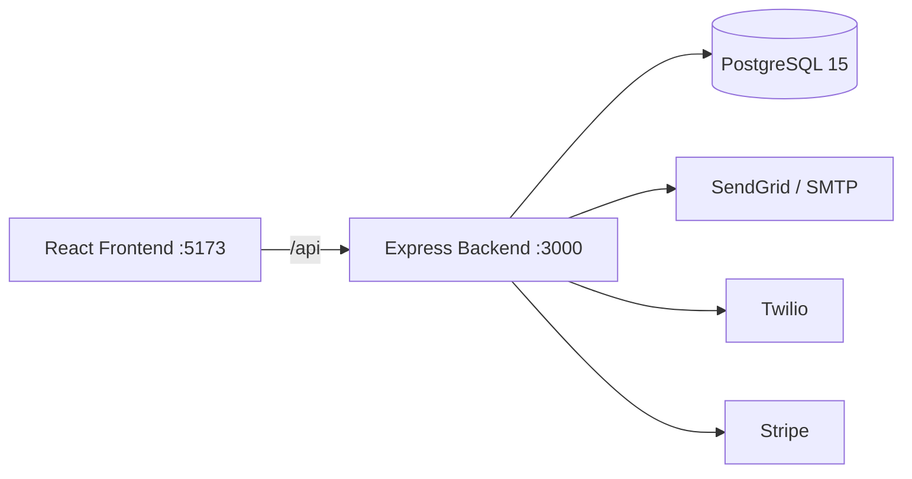

# Visión General

> Sistema SaaS de gestión clínica multi-tenant para administrar clínicas, pacientes, médicos, citas, historiales clínicos, facturación, laboratorio y análisis.

## Stack Tecnológico

| Capa | Tecnología |
|------|-----------|
| Frontend | React 19, Vite 8, TypeScript 6, React Router 7, FullCalendar 6, Recharts 3 |
| Backend | Node.js 20, Express 4, TypeScript 5.8, Zod 4, node-cron, Winston |
| Base de Datos | PostgreSQL 15, pg (raw SQL), pool con replicación |
| Infraestructura | Docker Compose, Render, Ubuntu |
| CI/CD | GitHub Actions (typecheck, test, build, deploy) |
| Monitoreo | Sentry, logs estructurados Winston |
| Email | SendGrid + nodemailer (Gmail SMTP fallback) |
| SMS/WhatsApp | Twilio (modo log en desarrollo) |
| Pagos | Stripe (modo simulado sin API key) |

## Funcionalidades Principales

- **Autenticación**: JWT + refresh tokens con rotación, bcrypt, 2FA TOTP
- **RBAC**: Roles `superadmin`, `admin`, `doctor`, `lab_technician`, `patient`, `guest`, `user`
- **Agenda médica**: Creación, cancelación, slots disponibles, disponibilidad semanal, excepciones
- **Reserva como invitado**: Booking sin login mediante RUT chileno
- **Historia Clínica Electrónica**: Registros SOAP, recetas, CIE-10, PDF
- **Facturación**: Facturas, pagos, seguros, integración Stripe
- **Laboratorio**: Catálogo de exámenes, solicitudes, resultados
- **Dashboard analítico**: KPIs, gráficos, pronóstico de demanda, tendencias
- **Auditoría**: Logs encadenados con HMAC-SHA256, verificación de integridad
- **Multi-tenancy**: Base de datos compartida, planes SaaS con límites
- **Internacionalización**: 2 idiomas activos (es/en)
- **Notificaciones**: Email, SMS/WhatsApp, recordatorios automáticos cada 5 min

## Arquitectura

Patrón: **Monolito modular** — un solo deploy con 14 módulos débilmente acoplados dentro de `src/modules/`.

---

Tags: #vision-general #stack #arquitectura
