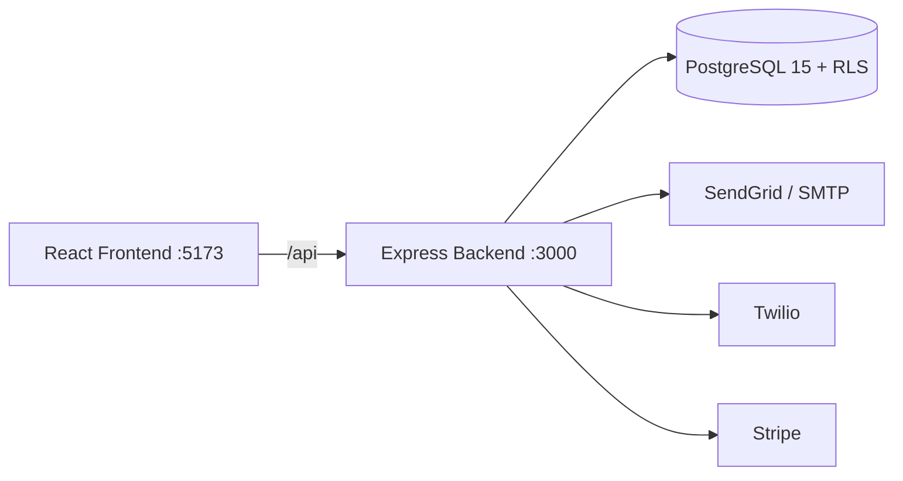

# Visión General

> Sistema SaaS de gestión clínica multi-tenant para administrar clínicas, pacientes, médicos, citas, historiales clínicos, facturación, laboratorio y análisis.

## Stack Tecnológico

| Capa | Tecnología |
|------|-----------|
| Frontend | React 19, Vite 6, TypeScript 5.7 (strict), React Router 7, MUI 6, FullCalendar 6, Recharts 2, TanStack Query/Table, react-hook-form + zod 3 |
| Backend | Node.js 20, Express 4.21, TypeScript 5.8 (strict), Zod 4, node-cron, Winston |
| Base de Datos | PostgreSQL 15, pg (raw SQL), pool con read replica opcional, RLS |
| Infraestructura | Docker Compose, Render, Ubuntu |
| CI/CD | GitHub Actions (npm audit, typecheck, test, build) |
| Monitoreo | Sentry, logs estructurados Winston |
| Email | SendGrid + nodemailer (SMTP/log fallback) |
| SMS/WhatsApp | Twilio (modo log en desarrollo) |
| Pagos | Stripe (modo simulado sin API key) |

## Funcionalidades Principales

- **Autenticación**: JWT + refresh tokens con rotación, bcrypt, 2FA TOTP, reCAPTCHA, token versioning
- **Sesiones**: Gestión y revocación de sesiones activas (`user_sessions`)
- **RBAC**: Roles `superadmin`, `admin`, `doctor`, `lab_technician`, `patient`, `guest`, `user`
- **Agenda médica**: Creación, cancelación, slots disponibles, disponibilidad semanal, excepciones, feriados, series recurrentes
- **Reserva como invitado**: Booking sin login mediante RUT chileno + waitlist
- **Historia Clínica Electrónica**: Registros SOAP, recetas, CIE-10, PDF, plantillas clínicas
- **Facturación**: Facturas, pagos, seguros, integración Stripe
- **Laboratorio**: Catálogo de exámenes, solicitudes, muestras, equipos, reactivos, control de calidad, resultados
- **Dashboard analítico**: KPIs, gráficos, pronóstico de demanda (media móvil), tendencias
- **Reportes**: Generación de reportes con exportación PDF
- **Notificaciones**: In-app + email, recordatorios automáticos, webhooks
- **Auditoría**: Logs encadenados con HMAC-SHA256, verificación de integridad
- **Multi-tenancy**: Base de datos compartida con RLS, planes SaaS con límites
- **Internacionalización**: 4 idiomas activos (es/en/pt/fr) con paridad de claves
- **Integraciones**: Webhooks, exportación de datos (GDPR/data portability)

## Arquitectura

Patrón: **Monolito modular** — un solo deploy con 23 módulos débilmente acoplados dentro de `src/modules/`.

---

Tags: #vision-general #stack #arquitectura