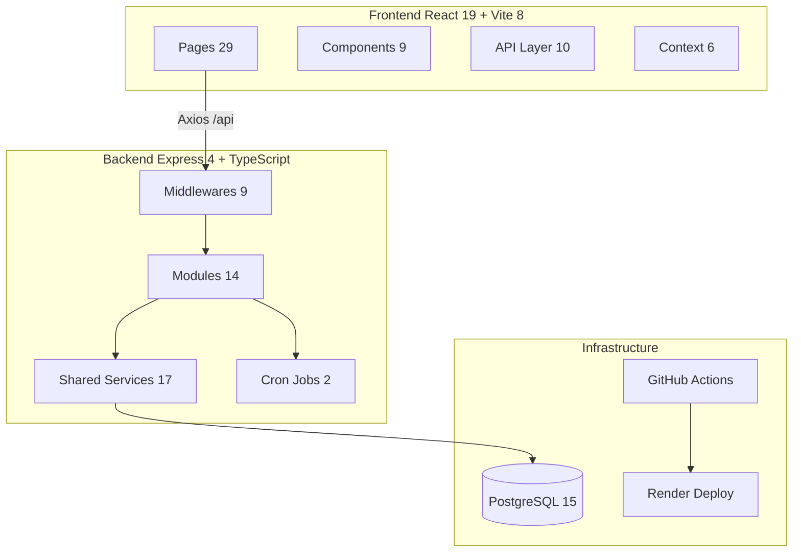

# Arquitectura General

> Monolito modular: un solo deploy con módulos lógicamente separados.

## Vista de Alto Nivel



## Pipeline de Middlewares

```mermaid
graph LR
    A[Request] --> B[Helmet + HPP]
    B --> C[CORS]
    C --> D[Compression]
    D --> E[Request Logger]
    E --> F[Rate Limit Global]
    F --> G[Auth JWT]
    G --> H[Role Authorization]
    H --> I[Feature Flag]
    I --> J[Validate Zod]
    J --> K[Audit Log]
    K --> L[Handler]
```



## Estructura de Módulo

Cada módulo en `src/modules/<nombre>/` sigue:

```
module/
├── module.controller.ts   # Handlers Express (asyncHandler)
├── module.service.ts      # Lógica de negocio + consultas DB
├── module.routes.ts       # Definición de rutas
├── module.schema.ts       # Validación Zod (cuando aplica)
└── (opcional)
    ├── module.email.ts    # Plantillas de email
    └── ...
```

## Multi-tenencia

- Base de datos compartida con `tenant_id` en todas las tablas
- Aislamiento vía `WHERE tenant_id = ?`
- JWT incluye `tenant_id`
- Middleware inyecta `req.tenant_id` y `req.locale`

## Convenciones API

- Prefijo: `/api`
- Paginación: `{ data, pagination }`
- Errores: `{ error, details, stack }`
- Auth: `Authorization: Bearer <token>`
- Tenant: Header `X-Tenant-Id` o desde JWT

---

Tags: #arquitectura #general #monolito-modular
