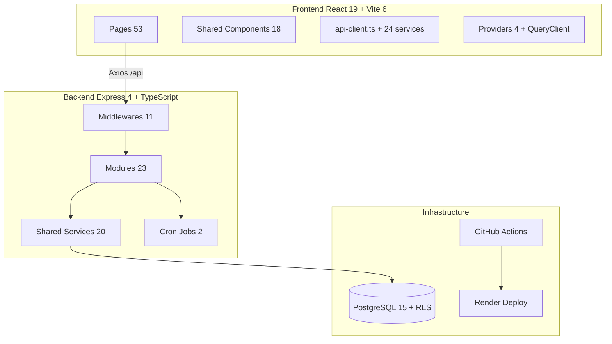

# Arquitectura General

> Monolito modular: un solo deploy con módulos lógicamente separados.

## Vista de Alto Nivel



## Pipeline de Middlewares (orden real en `app.ts`)

```mermaid
graph LR
    A[Request] --> B[Security Helmet + HPP]
    B --> C[Compression]
    C --> D[Health / CORS]
    D --> E[Cookie + JSON 100KB]
    E --> F[CSRF]
    F --> G[Optional Auth]
    G --> H[Tenant + RLS]
    H --> I[Activity]
    I --> J[CorrelationId]
    J --> K[Logger]
    K --> L[Rate Limit Global + Auth + PHI]
    L --> M[Routers]
    M --> N[Feature/Validate/RBAC]
    N --> O[Handler]
    O --> P[Error Handler]
```



## Estructura de Módulo

Cada módulo en `src/modules/<nombre>/` sigue:

```
module/
├── module.controller.ts   # Handlers Express (asyncHandler)
├── module.service.ts      # Lógica de negocio + consultas DB
├── module.routes.ts       # Definición de rutas
├── module.schema.ts       # Validación Zod (cuando aplica)
└── (opcional)
    ├── module.email.ts    # Plantillas de email
    ├── module.pdf.service.ts
    └── module.events.service.ts
```

## Multi-tenencia

- Base de datos compartida con `tenant_id` en todas las tablas
- **RLS FORCE** en 47 tablas vía GUC `app.tenant_id` por sesión (`set_tenant_id()`)
- JWT incluye `tenant_id`
- Middleware inyecta `req.tenant_id` y ejecuta el contexto RLS
- Chequeos BOLA en `shared/ownership.ts` (médico ↔ paciente)

## Convenciones API

- Prefijo: `/api`
- Paginación: `{ data, pagination }`
- Errores: `{ error, details, stack }` (stack solo en desarrollo)
- Auth: `Authorization: Bearer <token>`
- Tenant: Header `X-Tenant-Id` o desde JWT
- CSRF: Header `X-CSRF-Token` en métodos no seguros

---

Tags: #arquitectura #general #monolito-modular