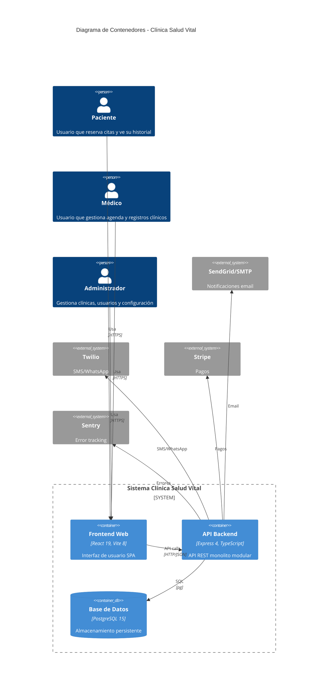
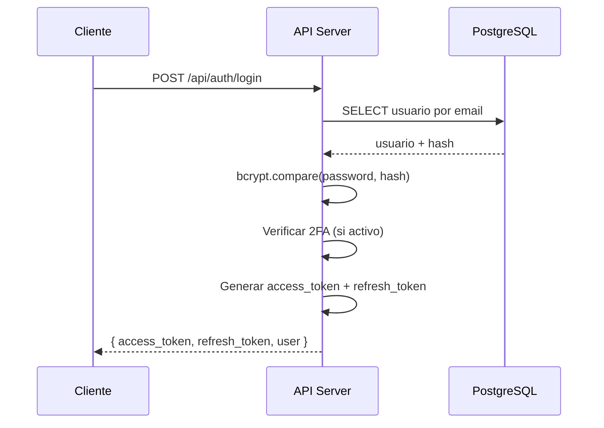
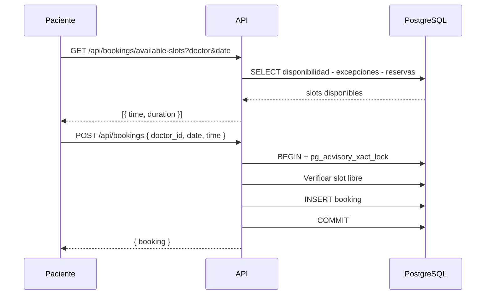

# Diagramas del Sistema

> Diagramas de arquitectura, secuencia y flujo de datos.

## Diagrama de Contenedores (C4 Nivel 2)

## Flujo de Autenticación

## Flujo de Reserva

---

Tags: #diagramas #c4 #mermaid
