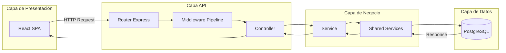
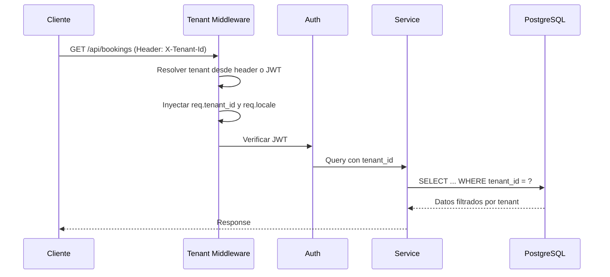

# Flujo de Datos

> Cómo fluyen los datos a través del sistema.

## Flujo General

```mermaid
graph LR
    subgraph "Capa de Presentación"
        FE[React SPA]
    end
    subgraph "Capa API"
        RT[Router Express]
        MW[Middleware Pipeline]
        CT[Controller]
    end
    subgraph "Capa de Negocio"
        SV[Service]
        SH[Shared Services]
    end
    subgraph "Capa de Datos"
        DB[(PostgreSQL)]
    end

    FE -->|HTTP Request| RT
    RT --> MW
    MW --> CT
    CT --> SV
    SV --> SH
    SH --> DB
    DB -->|Response| SH
    SH --> SV
    SV --> CT
    CT --> FE
```

## Flujo Multi-Tenant

```mermaid
sequenceDiagram
    participant C as Cliente
    participant T as Tenant Middleware
    participant A as Auth
    participant S as Service
    participant DB as PostgreSQL

    C->>T: GET /api/bookings (Header: X-Tenant-Id)
    T->>T: Resolver tenant desde header o JWT
    T->>T: Inyectar req.tenant_id y req.locale
    T->>A: Verificar JWT
    A->>S: Query con tenant_id
    S->>DB: SELECT ... WHERE tenant_id = ?
    DB-->>S: Datos filtrados por tenant
    S-->>C: Response
```

---

Tags: #flujo-de-datos #arquitectura
