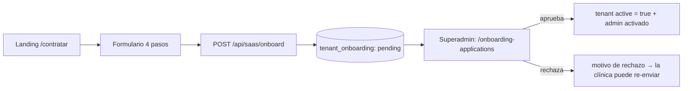

# Onboarding SaaS — Investigación y Decisiones

> Investigación de mejores prácticas para el onboarding de clínicas en Vitaria y decisiones de diseño aplicadas (2026-09).

## Visión General

El onboarding determina el primer contacto de una clínica con la plataforma. El patrón adoptado en Vitaria es **"submitted-first"** (solicitud enviada primero, tenant activado tras revisión del superadmin): el formulario público crea la solicitud y las credenciales admin, pero la clínica solo opera plenamente cuando el superadmin aprueba la solicitud contra los documentos subidos.

## Mejores Prácticas Investigadas

### Patrones de aprovisionamiento de tenants

| Patrón | Descripción | Ejemplo del mercado | Riesgo |
|--------|-------------|--------------------|--------|
| **Self-serve inmediato** | El tenant se crea y activa al instante; el pago/verificación ocurre después | SaaS horizontales con pago por tarjeta (Stripe Checkout como bandera) | Fraude y tenants "fantasma" sin datos reales |
| **Submitted-first (adoptado)** | La solicitud se envía con documentos; el proveedor aprueba antes de activar el tenant | tbioscan (healthcare) — flujo "primero el expediente, luego el tenant" | Latencia entre registro y primer uso |
| **Provisioner asíncrono / cola** | El tenant se crea vía job en background con retry/backoff | dudoxx Tenant Provisioner, SaaS con pool de recursos | Complejidad de infraestructura |

Para SaaS de salud (datos protegidos, licencias sanitarias) el patrón **submitted-first** es el estándar de la industria: reduce fraude, garantiza documentación legal/regulatoria antes de operar y evita costos de storage desperdiciados.

### Prácticas clave del mercado

1. **Formulario multi-paso con progreso visible** — reduce abandono (~60% de los SaaS B2B usan 3-5 pasos con stepper).
2. **Solicitar documentos en el propio formulario** (contrato, licencia, RUT/TAX ID) en lugar de hacerlo post-registro.
3. **Completitud visible** — mostrar el porcentaje de datos faltantes al solicitante y al superadmin para acelerar la aprobación (Knack / flujos HIPAA muestran "pipeline" de aprobación).
4. **Estado trazable**: `pending → approved | rejected` con motivo de rechazo y re-envío.
5. **Revisión humana + promoción automática**: el tenant se activa con un simple `active = true` una vez aprobado.
6. **Idempotencia y rate limiting** en el endpoint público de registro para evitar spam.
7. **Almacenamiento de documentos aislado por tenant** con categorías tipadas (contract, license, tax_id, constitution, logo, other).

## Decisiones Aplicadas en Vitaria

### Flujo diseñado

### Decisiones clave

| Decisión | Detalle |
|----------|---------|
| Tablas nuevas | `tenant_onboarding` + `onboarding_documents` (migración 026) |
| RLS | No RLS en las tablas nuevas; scoping por `tenant_id` en service layer (coherente con el SaaS) |
| Completitud | `computeCompleteness()` evalúa 14 checks (13 campos + `contract_document`) |
| Storage | `uploads/onboarding/<onboardingId>/<storedName>`, máx 10 MB, MIME whitelist |
| Aprobación | `PATCH /onboarding/applications/:id/approve` activa el tenant (`active = true`) |
| Rate limiting | `/api/saas/onboard` público con límite de 3/hora |
| i18n | Namespace `onboarding` completo en es/en/pt/fr |

### Rutas API

| Método | Ruta | Auth |
|--------|------|------|
| POST | `/api/saas/onboard` | ❌ público (3/h) |
| GET/PATCH | `/api/saas/onboarding` | admin, superadmin |
| POST/GET | `/api/saas/onboarding/documents` | admin, superadmin |
| GET/DELETE | `/api/saas/onboarding/documents/:id` | admin, superadmin |
| GET | `/api/saas/onboarding/applications` | superadmin |
| PATCH | `/api/saas/onboarding/applications/:id/approve` | superadmin |
| PATCH | `/api/saas/onboarding/applications/:id/reject` | superadmin |

## Pendientes / Mejoras Futuras

- Envío de email con estado de la solicitud (aprobada/rechazada).
- Re-check de plan en el momento de aprobación (hoy conserva el `plan_code` enviado).
- Compresión/escaneo de malware en documentos subidos antes de aprobación.
- Completeness re-calculado en el frontend en tiempo real (hoy se actualiza en el backend).

## Relacionados

- [[Wiki|Volver al índice principal]]
- [[Multi-Tenancy]]
- [[SaaS]]

---

Tags: #arquitectura #saas #onboarding #multi-tenant