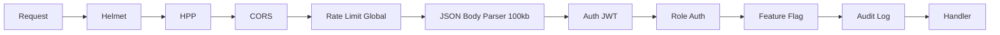

# Seguridad Arquitectónica

> Pipeline de seguridad y estrategia de defensa en profundidad.

## Pipeline de Middlewares

## Capas de Seguridad

| Capa | Middleware | Propósito |
|------|-----------|-----------|
| 1 | `security.middleware.ts` | Helmet (CSP, HSTS, frameguard) + HPP |
| 2 | CORS | Lista blanca: `FRONTEND_URL` + localhost |
| 3 | `requestLogger.middleware.ts` | Logging con Winston |
| 4 | Rate Limit | Global (500/15min), Auth (5/15min), PHI (30/15min) |
| 5 | `auth.middleware.ts` | Verificación JWT |
| 6 | `feature.middleware.ts` | Feature flags por plan SaaS |
| 7 | `validate.middleware.ts` | Validación Zod de inputs |
| 8 | `errorHandler.middleware.ts` | Manejo centralizado de errores |

## Headers de Seguridad (Helmet)

| Header | Valor |
|--------|-------|
| Content-Security-Policy | `default-src 'self'` |
| Strict-Transport-Security | `max-age=31536000; includeSubDomains` |
| X-Content-Type-Options | `nosniff` |
| X-Frame-Options | `DENY` |

## Rate Limiting

| Nivel | Ventana | Máx | Aplica a |
|-------|---------|-----|----------|
| Global | 15 min | 500 | Todas las rutas (excepto /health) |
| Auth | 15 min | 5 | Login, register |
| Guest booking | 1 hora | 5 | Booking invitado |
| SaaS onboard | 1 hora | 3 | Onboarding |

---

Tags: #seguridad #middleware #arquitectura
