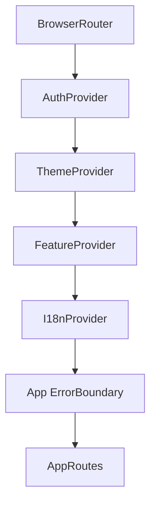

# Routing

> Sistema de rutas y protección de acceso.

## Configuración

## Tipos de Rutas

| Tipo | Guard | Descripción |
|------|-------|-------------|
| Públicas | Ninguno | Acceso sin autenticación |
| Protegidas | `ProtectedRoute` | Requiere JWT válido |
| Por rol | `ProtectedRoute` + `role` prop | Requiere rol específico |
| Por feature | `WithFeature` | Requiere feature flag del plan |

## ProtectedRoute

El componente `ProtectedRoute`:
1. Mientras auth carga → `<LoadingState />`
2. Sin usuario → redirect a `/`
3. Con `role` prop → verifica `user.role`
4. Admin también pasa rutas de superadmin

## Feature Gates

`WithFeature` condiciona el renderizado según feature flags del plan SaaS (ej: `laboratory`).

---

Tags: #frontend #routing #proteccion
