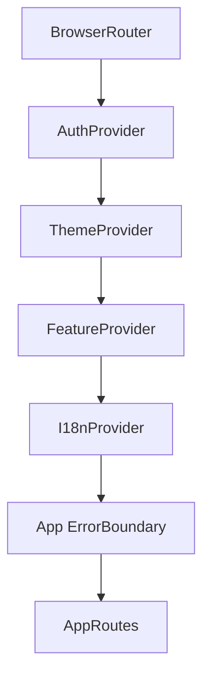

# Routing

> Sistema de rutas y protección de acceso. Definido en `frontend/src/app/router/AppRouter.tsx` con lazy loading (`React.lazy` + `Suspense`).

## Configuración

## Tipos de Rutas

| Tipo | Guard | Descripción |
|------|-------|-------------|
| Públicas | Ninguno | Landing (`/`), `/register`, `/forgot-password`, `/2fa`, `/booking`, `/confirm/:token` |
| Protegidas | `ProtectedRoute` | Requiere JWT válido |
| Por rol | `ProtectedRoute` + `allowedRoles` | Requiere rol específico |
| Por feature | `FeatureRoute` | Requiere feature flag del plan (`laboratory`) |

## ProtectedRoute

El componente `ProtectedRoute`:
1. Mientras auth carga → `<LoadingState />`
2. Sin usuario → redirect a `/`
3. Con `allowedRoles` → verifica `user.role` y redirige a `getRedirectPath(role)`
4. `UsersRoute` resuelve entre `SuperAdminUsersPage` (superadmin) o `UsersPage` (admin)

## Rutas Principales

| Ruta | Página |
|------|--------|
| `/` | Landing pública |
| `/dashboard` | Dashboard por rol |
| `/tenants` `/tenants/:id` | Super Admin — clínicas y detalle |
| `/users` `/super-admin/users` | Usuarios (admin / superadmin) |
| `/cobros` | Super Admin — facturación SaaS |
| `/saas` | Super Admin — panel KPIs globales |
| `/specialties` | Especialidades (superadmin) |
| `/audit` | Auditoría (superadmin) |
| `/clinical` `/management` | Hubs de clínica y gestión |
| `/bookings` | Citas por rol |
| `/clinical-records` `/clinical-records/:id` | Fichas clínicas |
| `/prescriptions` | Recetas del paciente |
| `/medical-history` `/medical-history/:id` | Historial médico |
| `/laboratory/*` | Laboratorio (feature-gated: requests, catalog, quality-control, analytics, area) |
| `/analytics` | Analytics (lab_technician) |
| `/reports` | Reportes (lab_technician) |
| `/my-laboratory` `/my-laboratory/:id` | Resultados lab del paciente |
| `/doctor/lab-results` | Solicitudes lab del doctor (doctor) |
| `/admin/*` | Vistas admin (lab-requests, medical-history, demo-data) |
| `/panel` | Panel del doctor |
| `/patient-history` | Historial clínico por paciente (doctor) |
| `/settings` | Perfil, seguridad y notificaciones |
| `*` | 404 — `NotFoundPage` |

## Feature Gates

`FeatureRoute` condiciona el renderizado según feature flags del plan SaaS (ej: `laboratory`). Si el tenant no tiene la feature, muestra `<PremiumLocked />`.

---

Tags: #frontend #routing #proteccion
