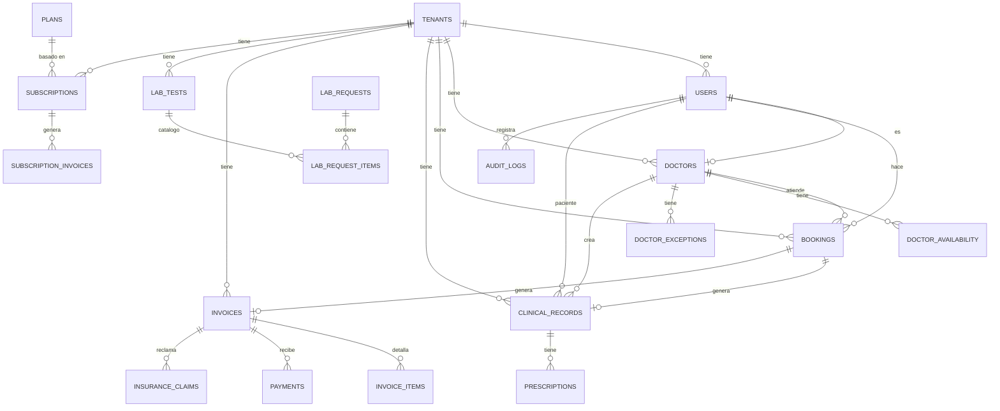

# Modelo de Datos

> Diagrama entidad-relación del sistema.

## Diagrama General

## Principios

- **Shared database**: Todos los tenants comparten las mismas tablas
- **Aislamiento**: Columna `tenant_id` en todas las tablas con datos de tenant
- **SQL raw**: Sin ORM, queries manuales con `pg`
- **Índices**: Cubren los patrones de consulta más comunes (fecha + tenant + estado)

---

Tags: #base-de-datos #modelo #er-diagram
