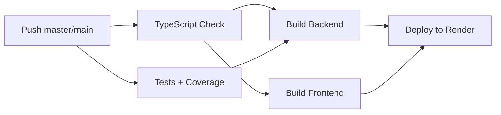

# CI/CD

> Pipeline de integración continua y despliegue automático.

## GitHub Actions

Archivo: `.github/workflows/ci.yml`

### Jobs

### Detalle de Jobs

| Job | Runner | Comando | Descripción |
|-----|--------|---------|-------------|
| `typecheck` | ubuntu-latest | `npm run typecheck` | Verificación de tipos TypeScript |
| `test` | ubuntu-latest | `npm test` | Tests + cobertura, sube artifact |
| `build-backend` | ubuntu-latest | `npm run build:backend` | Compilación TS |
| `build-frontend` | ubuntu-latest | `npm run build` (frontend/) | Build Vite |
| `deploy` | ubuntu-latest | curl + health check | Deploy a Render + verificación |

### Deploy

Solo en push a `master`. Post-deploy:
1. Trigger webhook de Render
2. Health check cada 10s (hasta 30 intentos)
3. Verifica DB status en `/health`

---

Tags: #devops #ci-cd #github-actions
