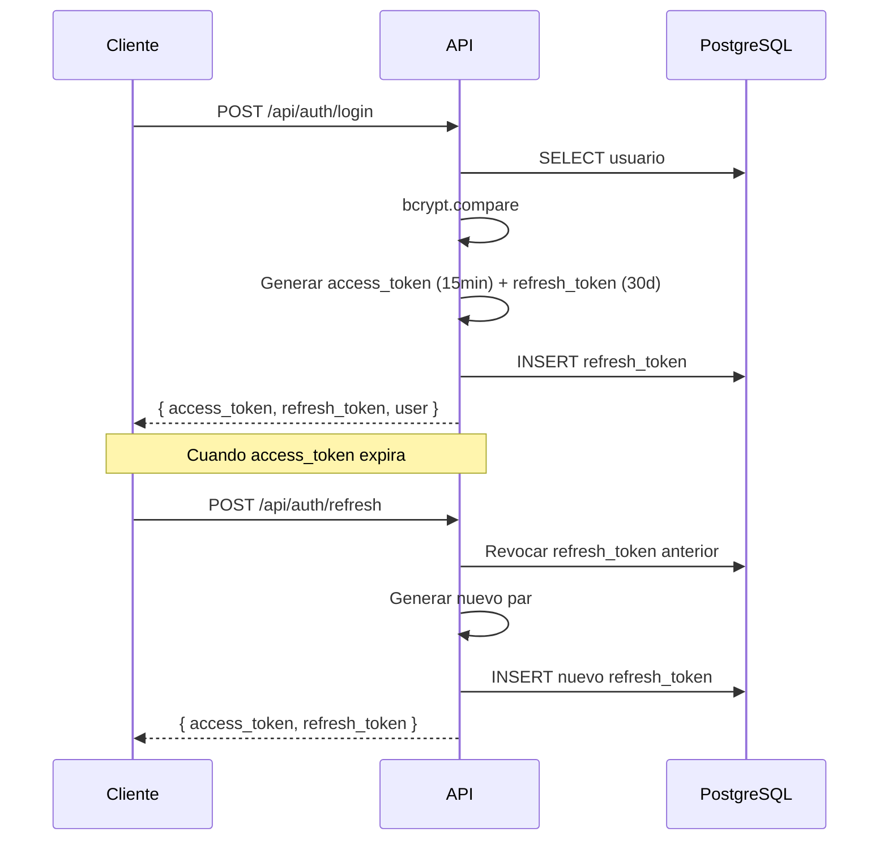

# Autenticación

> JWT, refresh tokens y 2FA.

## Flujo de Tokens



## Access Token

```json
{
  "id": 1,
  "email": "doctor@clinic.com",
  "role": "doctor",
  "tenant_id": "default",
  "iat": 1680000000,
  "exp": 1680000900
}
```

- Algoritmo: HS256
- Expiración: 15 minutos
- Secreto: `JWT_SECRET` (≥ 32 caracteres)

## Refresh Token

- Expiración: 30 días
- Almacenado en tabla `refresh_tokens`
- Rotación: Cada refresh revoca el anterior
- Revocación manual posible

## 2FA (TOTP)

- RFC 6238, paso 30s, tolerancia ±1 paso
- Secreto: 20 bytes aleatorios en base32
- Almacenado cifrado (AES-256-GCM) en `users.totp_secret`
- Compatible con Google Authenticator, Authy

## Política de Contraseñas

| Regla | Valor |
|-------|-------|
| Largo mínimo | 8 caracteres |
| Mayúscula | ≥ 1 |
| Minúscula | ≥ 1 |
| Dígito | ≥ 1 |
| Carácter especial | ≥ 1 |
| Hash | bcrypt 12 rounds |

---

Tags: #seguridad #autenticacion #jwt #2fa
